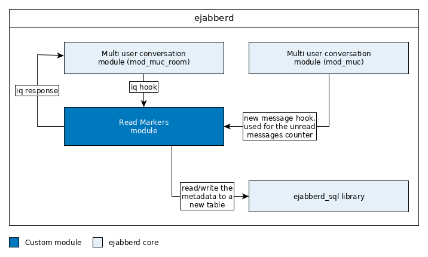

# Jabber Read Makers

## Table of contents

- [Table of contents](#table-of-contents)
- [Terminology](#terminology)
- [Prequel](#prequel)
- [Glossary](#glossary)
- [Introduction](#introduction)
- [Workflow](#workflow)
  - [Acknowledge a message](#acknowledge-a-message)
  - [Receive last acknowledged message](#receive-last-acknowledged-message)
- [Implementation](#implementation)
  - [Architecture](#architecture)
  - [ejabberd module](#ejabberd-module)
  - [Database schema](#database-schema)

## Terminology

In this document, the key words `MUST`, `MUST NOT`, `REQUIRED`,
`SHALL`, `SHALL NOT`, `SHOULD`, `SHOULD NOT`, `RECOMMENDED`, `MAY`,
and `OPTIONAL` are to be interpreted as described in BCP 14, RFC 2119.

## Prequel

* https://xmpp.org/extensions/xep-0012.html
* https://xmpp.org/extensions/xep-0333.html
* https://github.com/processone/ejabberd/issues/1988#issuecomment-329434809

## Glossary

* **Room**: An XMPP multi user conversation (MUC), an XMPP entity
* **XMPP presence application**: All short- and long lived
  applications which subscribes to or publishes contents via the XMPP
  protocol
* **XMPP client application**: A general user client which enables the user to
  view messages and write new ones. (eg. Makelerportal Frontend, the HAUSGOLD
  CRM iOS app)

## Introduction

This concept features a custom implementation of the XEP-0333 extension in its
core. It is spiced with requirements directly associated to HAUSGOLD and could
be partially/fully used by third parties.

The first requirement is to persist the last seen/read message by any
client/presence application on the central XMPP service. No matter of the
device a user is using we want be able to know which was the last seen/read
message. This is especially important for cross-device users. (Eg. mobile iOS
app and reactive web app on a desktop machine) Any client/presence application
MUST be able to send (acknowledge) and retrieve the last seen/read message by a
simple iq stanza on a room.

The second requirement is the total amount of unread messages per user on a
specific room. This can be really helpful in dashboard situations to display
the number of new messages. But this is also a really comfortable way to
determine if there are any unread messages for a specific user on a specific
room.

## Workflow


1. Bob sends a message to a room

    The first step is that Bob decides to send a message to a room were he
    is members along with John and Alice. He sends the message, so the
    XMPP service SHALL automatically acknowledge his last read message as
    the one he was writing right now. The unseen message counters of John
    and Alice on that room increment each by one.

2. John is online and acknowledges the message as read

    Fortunately John is online and has opened the chat room for a while.
    He directly sees the new message from Bob and his App sends an
    acknowledge request to the XMPP server. The App is RECOMMENDED to send
    the acknowledge request at least after 2 seconds after the last
    message is displayed on the screen.

3. Alice is offline and did not read the message yet

    Unfortunately Alice is offline and her mobile device is locked in her
    pocket.

4. Alice comes online and acknowledge the message was read

    After a little while she picks it up and unlocks it and then
    she is browsing the App and comes back to the dashboard page. There
    she sees the unseen message count of each room where she is a member
    of. The App SHALL query the unseen message count for each room of
    Alice's dashboard. The App is RECOMMENDED to display the unseen count
    when it is greater than zero, to visually notify the user.

5. Bob retrieve the last read message of John and Alice

    Bob is actively looking at the history of the chat room and waits for
    an anwer. His App MAY query the last read message of John and Alice on
    this room periodically to show an indicator that the message was read
    by all members. The XMPP server SHALL allow the querying of the last
    read message of another member of a room.

### Acknowledge a message

The actual message acknowledgment is straightforward an iq stanza which
specifies the last read/shown message by its stanza id. Just send this changing
iq stanza and the service will take care of the message read marker on his data
store. Be sure to send a full user JID as the sender (`from` attribute), and a
bare room JID as the recipient (`to` attribute). The JIDs are persisted in bare
form, but the sender receives an empty iq result which is delivered to the
correct session.

```xml
<iq from="alice@example.com/iphone"
    id="..."
    to="test@conference.example.com"
    type="set">
  <ack xmlns="urn:xmpp:read-markers" id="1523085730748465" />
</iq>
```

The resulting iq stanza looks like this:

```xml
<iq from="test@conference.example.com"
    id="..."
    to="alice@example.com/iphone"
    type="result" />
```

The service SHOULD send the answer iq stanza to be XMPP conform, even when the
result is empty and therefore successful.  The result does not reflect the
persistence of the acknowledgment. Errors MAY just be swallowed.

### Receive last acknowledged message

Any client/presence application can retrieve the last seen/read stanza of the
user by querying the `urn:xmpp:read-markers` namespace of an actual room/user
combination. A client MAY also query the last seen/read stanza of any other
participant of a room. The iq stanza recipient (`to` attribute) specifies the
room to ask for. The user MAY be specified on the `query` element (using the
`jid` attribute). When this information is missing the service SHOULD assume
the sender (`from` attribute) to be the subject of the query.

```xml
<iq from="alice@example.com/iphone"
    id="..."
    to="test@conference.example.com"
    type="get">
  <query xmlns="urn:xmpp:read-markers"
         jid="bob@example.com" />
</iq>
```

The result of the query iq stanza MUST contain the last seen `stanza-id` which
was send by the last acknowledgment iq stanza and the moment when the service
received the acknowledgment. Additionally the service SHOULD send the amount of
unseen/unread messages on the room for the user. An example result looks like
this:

```xml
<iq from="test@conference.example.com"
    id="..."
    to="alice@example.com/iphone"
    type="result">
  <last-message xmlns="urn:xmpp:read-markers" id="1523085730748465">
    <seen-at>2018-08-06T11:58:37.651721Z</seen-at>
  </last-message>
  <unseen-messages xmlns="urn:xmpp:read-markers" amount="8" />
</iq>
```

The service MUST NOT validate the acknowledged message stanza id. The client
MUST provide a useful value to the service.

## Implementation

### Architecture



The module MUST be capable of handling iq requsts passed from the IQ hook of
the mod_muc_room and listening for messages with a hook from the mod_muc
module. The MUC service triggers a hook for new messages on a room, so we can
collect and sum up unread messages. The acknowledgment iq requsts update the
metadata records on the SQL database and reset the unread message counter
accordingly. (This is not a safe/atomar counter, use it as an approximately
value) The module MUST register an XML namespace for listening only to relevant
IQ requests.

### ejabberd module

The module MAY be written in Elixir or pure Erlang.  See the [ejabberd
module development
guide](https://docs.ejabberd.im/developer/extending-ejabberd/modules/) for
futher details.  See the [`ejabberd_sql`
library](https://github.com/processone/ejabberd-contrib/issues/227#issuecomment-328638111)
for details on interacting with the SQL database.

### Database schema

The underlying database schema features an additional table which holds the
last seen/read message data.  The ejabberd module MUST manage this table by
concrete inserts/updates. The schema is designed to be all-time persistent.
There is no regular cleanup required and no database pollution by design.

| Property        | Data type  | Notes                                                               |
| -----------     | ---------- | ---------                                                           |
| user_jid        | string     | The bare JID of the user                                            |
| room_jid        | string     | The bare JID of the room                                            |
| last_message_id | bigint     | The last message which was seen (and displayed) by any user session |
| last_message_at | bigint     | The timestamp when the last message was seen by any user session    |
| unseen_messages | integer    | The amount of unseen messages by the user                           |

The additional database table MAY be called `read_messages`.
